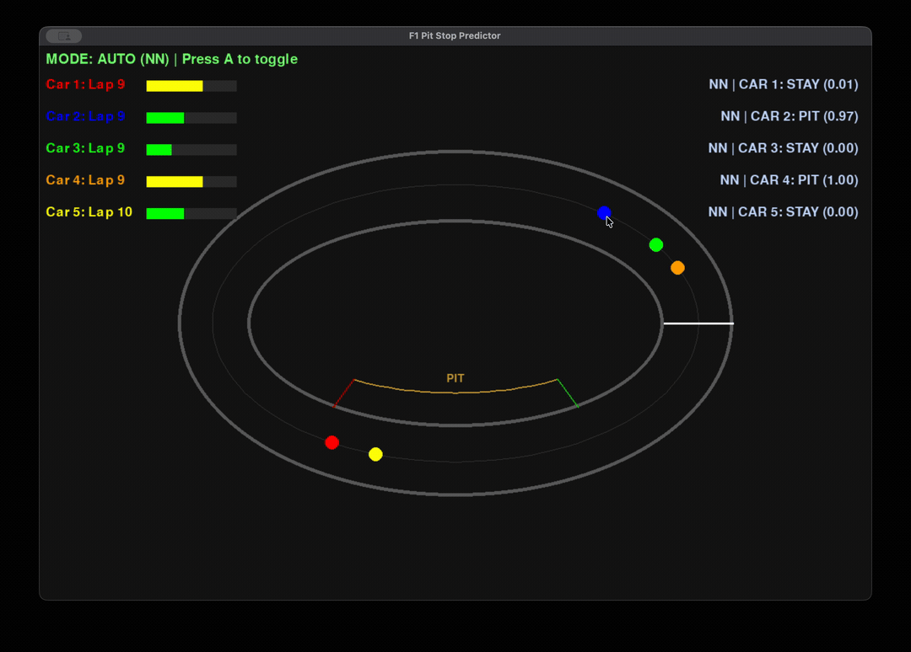
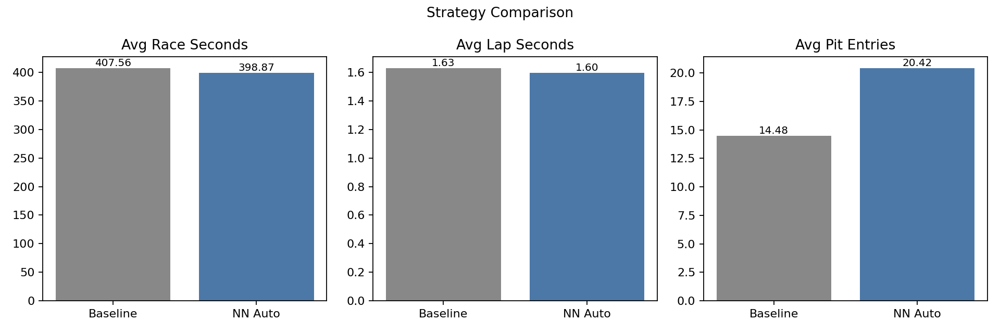

# F1 Pit Stop Predictor



A deep learning project that predicts optimal Formula 1 pit stop strategies using a neural network built from scratch with NumPy and a real-time 2D race simulation powered by Pygame.

## Project Structure

```
pitstop-predictor/
├── sim/                # 2D race simulation
│   ├── game.py         # Main loop, NN integration, mode toggle
│   ├── car.py          # Car physics, tire wear, pit state machine (4-phase)
│   ├── track.py        # Track geometry, pit lane (entry/exit zones, drawing)
│   └── render.py       # HUD overlay (laps, tire bars, safety car, pit status, NN recommendation)
├── ml/                 # Data pipeline + NumPy NN
│   ├── features.py     # 9 features per car at lap start
│   ├── oracle.py       # Rule-based pit label (0/1)
│   ├── collect_data.py # Headless sim → data/dataset.csv
│   ├── nn_numpy.py     # 2 hidden-layer NN (forward/backprop)
│   ├── train.py        # Training + model saving
│   └── eval.py         # Metrics + confusion matrix from saved model
├── assets/             # Media files
│   └── demo.gif        # Simulation demo recording
├── data/               # Generated outputs
│   ├── dataset.csv
│   ├── strategy_comparison.csv
│   └── strategy_comparison.png
├── models/             # Saved model (.npz)
├── requirements.txt
└── README.md
```

## Current Progress

- [x] **Sprint 1** — 2D track simulation: elliptical circuit, multi-car movement, lap counting, HUD
- [x] **Sprint 2** — Tire degradation, driving styles, traffic model, tire wear HUD, safety car, pit lane
- [x] **Sprint 3** — Feature extraction, oracle labeling, CSV dataset generation
- [x] **Sprint 4** — NumPy neural network, training pipeline, evaluation metrics
- [x] **Sprint 5** — Live prediction integration, mode toggle, strategy comparison

## Simulation Physics

Cars follow a simplified physics model for consistent and interpretable behavior:

```
current_speed = base_speed × tire_factor × traffic_factor × sc_factor
tire_factor    = 1 − 0.30 × tire_wear
traffic_factor = 0.85 – 1.0   (based on gap to car ahead)
sc_factor      = 0.60 – 0.80  (when safety car is active, else 1.0)
```

| Driving Style | Wear Rate | Behavior |
|---|---|---|
| Aggressive | 0.009 | Fastest early pace, tires degrade quickly |
| Normal | 0.006 | Balanced pace and degradation |
| Conservative | 0.004 | Slowest pace, tires last longest |

## Safety Car

A safety car event can trigger randomly during the race:

- **Trigger**: ~0.3% chance per frame when no cooldown is active
- **Duration**: 4–8 seconds, all cars slow down to 60–80% speed
- **Cooldown**: 15 seconds after each event before a new one can occur
- **HUD**: Yellow "SAFETY CAR" banner appears at top center

## Pit Lane

Cars automatically pit when tire wear reaches 75%:

| Phase | Behavior |
|---|---|
| **PIT SOON** | `tire_wear ≥ 0.75`, car waits for pit entry angle |
| **pit_in** | Car enters pit lane at 35% speed toward pit box |
| **pit_stop** | Car stops for 3 seconds, tires are replaced (`tire_wear → 0`) |
| **pit_out** | Car exits pit lane at 35% speed, rejoins the track |

The pit lane is drawn as a yellow arc inside the inner boundary, with green (entry) and red (exit) markers.

## Getting Started

### Prerequisites

- Python 3.12+

### Installation

```bash
git clone https://github.com/emirhannkilic/pitstop-predictor.git
cd pitstop-predictor
python -m venv venv
source venv/bin/activate   # Windows: venv\Scripts\activate
pip install -r requirements.txt
```

### Running the Simulation

```bash
cd sim
python game.py
```

A window will open showing a 2D elliptical track with five cars racing. The HUD displays each car's lap count, a color-coded tire wear bar, pit status (IN PIT / PIT SOON), safety car banner, and NN recommendation/confidence.

Mode behavior in simulation:
- `MODE: RECOMMENDATION` — NN only suggests `PIT/STAY OUT` on HUD
- `MODE: AUTO (NN)` — NN suggestions are applied to pit decisions
- Press `A` to toggle modes during runtime

### Generating the dataset (Sprint 3)

From the project root (with venv activated):

```bash
python ml/collect_data.py
```

This runs a headless simulation for 50 laps per car and writes `data/dataset.csv` with 9 features plus an oracle-generated `label` (0 = stay out, 1 = pit). Target pit ratio is 15–35%; the script prints the actual ratio after each run.

### Training the NumPy NN (Sprint 4)

From the project root:

```bash
python ml/train.py
```

This trains a 9→16→8→1 feedforward network (ReLU/ReLU/Sigmoid), then saves weights and normalization stats to:

`models/nn_model.npz`

### Evaluating the model (Sprint 4)

```bash
python ml/eval.py
```

`eval.py` loads `models/nn_model.npz` and reports:
- Validation loss
- Accuracy
- Precision / Recall / F1
- Confusion matrix (TN, FP, FN, TP)

Latest run:
- Accuracy: `0.9898`
- Precision: `0.9807`
- Recall: `0.9841`
- F1: `0.9824`
- Confusion matrix: `TN=3529, FP=28, FN=23, TP=1420`

### Strategy Comparison (Sprint 5)

Baseline vs NN-auto comparison is summarized in:
- `data/strategy_comparison.csv`
- `data/strategy_comparison.png` (bar chart)



Latest run (`100` races, same seeds):
- Baseline avg race seconds: `407.56`
- NN Auto avg race seconds: `398.87`
- NN gain vs baseline: `+8.70 sec`
- Baseline avg lap seconds: `1.6303`
- NN Auto avg lap seconds: `1.5955`

## License
